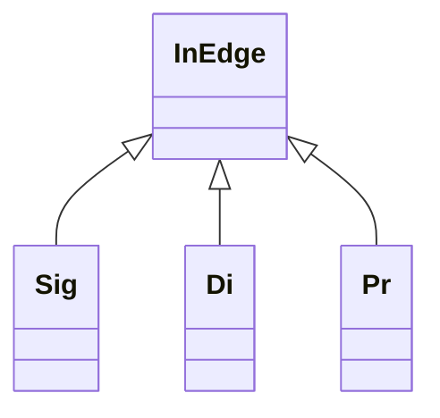

# `monocon_chuugoku.h` 全クラス・構造体・メソッド一覧

## 対象

- 対象ファイル：`monocon_chuugoku.h`
- クラス数：18
- 構造体数：2
- 列挙型数：2
- `public`、`protected`、`private`の全メソッドを掲載
- コンストラクタ、デストラクタ、演算子オーバーロード、削除されたコピー操作、静的内部関数を含む

## 一覧

| 分類 | 名前 | 主な用途 |
|---|---|---|
| 構造体 | `Dch` | デバウンス状態の保持 |
| クラス | `InEdge` | エッジ検出の基底クラス |
| クラス | `Sig` | 論理条件のエッジ検出 |
| クラス | `Di` | デジタル入力 |
| クラス | `Pr` | フォトリフレクタ入力 |
| クラス | `Sok` | 測距センサ |
| クラス | `Vr` | 可変抵抗 |
| クラス | `Js` | ジョイスティック |
| クラス | `Enc` | ロータリーエンコーダ |
| クラス | `Led` | RGB LED |
| クラス | `Disp` | 3桁7セグメント表示器 |
| クラス | `Dcm` | DCモータ |
| 列挙型 | `Dir` | ステッピングモータの回転方向 |
| クラス | `Spm` | ステッピングモータ |
| クラス | `Bz` | ブザーとメロディー |
| クラス | `Seq` | シーケンス制御 |
| クラス | `Iv` | 周期タイマー |
| クラス | `Ti` | 単発タイマー |
| クラス | `Sw` | ストップウォッチ |
| クラス | `Tog` | 汎用トグル |
| 構造体 | `board_detail::AdcSlot` | ADC登録スロット |
| 列挙型 | `Spm::Excitation` | ステッピングモータの励磁方式 |

---

## `Dch`

入力のデバウンス処理で使用する内部状態構造体です。メソッドはありません。

### メンバー

| 型 | 名前 | 内容 |
|---|---|---|
| `uint8_t` | `stable` | 現在の安定状態 |
| `uint8_t` | `candidate` | 安定候補の状態 |
| `uint32_t` | `stableSince` | 現在の安定状態になった時刻 |
| `uint32_t` | `candidateSince` | 候補状態が始まった時刻 |
| `bool` | `candidateActive` | 候補状態を確認中か |
| `bool` | `fired` | 長押しイベントを通知済みか |

---

## `InEdge`

`Sig`、`Di`、`Pr`が継承するエッジ検出の基底クラスです。

### 公開メソッド

| シグネチャ | 内容 |
|---|---|
| `explicit InEdge(uint16_t lock = 10)` | デバウンス時間をミリ秒で指定して初期化 |
| `bool ltoh()` | LOWからHIGHへの変化を1回取得 |
| `bool htol()` | HIGHからLOWへの変化を1回取得 |
| `bool level() const` | 現在の安定状態を取得 |
| `operator bool() const` | 現在の安定状態を`bool`として取得 |
| `bool held(uint16_t ms, bool lv, bool release = false)` | 指定状態の長押し、または解放時の長押しを判定 |
| `bool change()` | 方向を問わず状態変化を1回取得 |

### `protected`メソッド

| シグネチャ | 内容 |
|---|---|
| `void pollWith(uint8_t raw, uint32_t now)` | 生入力をデバウンスして安定状態とイベントへ反映 |
| `void serviceEdges(uint32_t epoch)` | 保持期限を過ぎたエッジイベントを破棄 |

---

## `Sig : public InEdge`

任意の論理条件をエッジ入力として扱うクラスです。`InEdge`の公開メソッドも使用できます。

### 公開メソッド

| シグネチャ | 内容 |
|---|---|
| `explicit Sig(uint16_t lock = 10)` | デバウンス時間を指定して生成 |
| `~Sig()` | 自動管理リストから登録解除 |
| `Sig(const Sig&) = delete` | コピー構築を禁止 |
| `Sig& operator=(const Sig&) = delete` | コピー代入を禁止 |
| `bool set(bool condition)` | 条件を入力し、現在の安定状態を返す |
| `bool update(bool condition)` | `set()`と同じ |
| `bool operator()(bool condition)` | `set()`と同じ |
| `void reset(bool level = false)` | 指定状態で内部状態と保留イベントを初期化 |
| `bool initialized() const` | 最初の入力が完了しているかを取得 |
| `bool changed()` | 状態変化を1回取得 |
| `uint32_t elapsed() const` | 現在の安定状態になってからの経過時間を取得 |
| `static void serviceAll(uint32_t epoch)` | 全`Sig`のイベント保持期限を処理 |

### `private`メソッド

| シグネチャ | 内容 |
|---|---|
| `void attach()` | 自動管理リストへ登録 |
| `void detach()` | 自動管理リストから登録解除 |

---

## `Di : public InEdge`

デジタル入力をエッジ付きで読み取るクラスです。`InEdge`の公開メソッドも使用できます。

### 公開メソッド

| シグネチャ | 内容 |
|---|---|
| `explicit Di(uint8_t pin, uint16_t lock = 10)` | 入力ピンとデバウンス時間を指定して生成 |
| `~Di()` | 自動管理リストから登録解除 |
| `Di(const Di&) = delete` | コピー構築を禁止 |
| `Di& operator=(const Di&) = delete` | コピー代入を禁止 |
| `static void serviceAll(uint32_t now)` | 全`Di`の物理入力を読み取る |
| `static void serviceEvents(uint32_t epoch)` | 全`Di`のイベント保持期限を処理 |

### `private`メソッド

| シグネチャ | 内容 |
|---|---|
| `bool valid() const` | ピンと管理リストへの登録が有効かを内部確認 |

---

## `Pr : public InEdge`

ADC値をしきい値で二値化するフォトリフレクタ入力クラスです。`InEdge`の公開メソッドも使用できます。

### 公開メソッド

| シグネチャ | 内容 |
|---|---|
| `explicit Pr(uint8_t pin, int threshold = 950, uint16_t lock = 10)` | ADCピン、しきい値、デバウンス時間を指定して生成 |
| `~Pr()` | 管理リストとADCから登録解除 |
| `Pr(const Pr&) = delete` | コピー構築を禁止 |
| `Pr& operator=(const Pr&) = delete` | コピー代入を禁止 |
| `int raw() const` | 最新のADC生値を安全に取得 |
| `static void serviceAll(uint32_t now)` | 全`Pr`をしきい値判定してエッジ処理 |
| `static void serviceEvents(uint32_t epoch)` | 全`Pr`のイベント保持期限を処理 |

### `private`メソッド

| シグネチャ | 内容 |
|---|---|
| `bool ready() const` | ADCの初回変換が完了したかを内部確認 |
| `bool valid() const` | ADCと管理リストへの登録が有効かを内部確認 |

---

## `Sok`

5サンプルの中央値から距離を求める測距センサクラスです。

### 公開メソッド

| シグネチャ | 内容 |
|---|---|
| `explicit Sok(uint8_t pin)` | ADCピンを指定して生成 |
| `~Sok()` | 管理リストとADCから登録解除 |
| `Sok(const Sok&) = delete` | コピー構築を禁止 |
| `Sok& operator=(const Sok&) = delete` | コピー代入を禁止 |
| `int raw() const` | 中央値処理後のADC値を取得 |
| `int mm() const` | 距離をミリメートルで取得 |
| `float cm() const` | 距離をセンチメートルで取得 |
| `static void serviceAll()` | 全`Sok`のサンプリングと距離更新を実行 |

### `private`メソッド

| シグネチャ | 内容 |
|---|---|
| `bool ready() const` | 5サンプルの初回処理が完了したかを内部確認 |
| `bool valid() const` | ADCと管理リストへの登録が有効かを内部確認 |
| `void serviceOne()` | 1サンプルを追加し、中央値と距離を更新 |

---

## `Vr`

可変抵抗のADC値を指定範囲へ変換するクラスです。

### 公開メソッド

| シグネチャ | 内容 |
|---|---|
| `explicit Vr(uint8_t pin, int minValue = 0, int maxValue = 512)` | ADCピンと入力範囲を指定して生成 |
| `~Vr()` | ADCから登録解除 |
| `Vr(const Vr&) = delete` | コピー構築を禁止 |
| `Vr& operator=(const Vr&) = delete` | コピー代入を禁止 |
| `int raw() const` | 最新のADC生値を安全に取得 |
| `int to(int lo, int hi) const` | ADC値を`lo`から`hi`の範囲へ線形変換 |

### `private`メソッド

| シグネチャ | 内容 |
|---|---|
| `bool ready() const` | ADCの初回変換が完了したかを内部確認 |
| `bool valid() const` | ADCへの登録が有効かを内部確認 |

---

## `Js`

ジョイスティックの座標と方向を取得するクラスです。

### 公開メソッド

| シグネチャ | 内容 |
|---|---|
| `Js(uint8_t px, uint8_t py)` | X軸とY軸のADCピンを指定して生成 |
| `~Js()` | 2軸をADCから登録解除 |
| `Js(const Js&) = delete` | コピー構築を禁止 |
| `Js& operator=(const Js&) = delete` | コピー代入を禁止 |
| `int x() const` | X軸のADC値を安全に取得 |
| `int y() const` | Y軸のADC値を安全に取得 |
| `void read(int& vx, int& vy) const` | X軸とY軸を同じ割り込み禁止区間で取得 |
| `int dir(int div, uint8_t rot = 0, bool mirror = false) const` | 方向を`div`分割した番号で取得。中心では`-1` |

### `private`メソッド

| シグネチャ | 内容 |
|---|---|
| `bool ready() const` | 両軸のADC初回変換が完了したかを内部確認 |
| `bool valid() const` | 両方のADC登録が有効かを内部確認 |

---

## `Enc`

ロータリーエンコーダの回転差分を割り込みで取得するクラスです。

### 公開メソッド

| シグネチャ | 内容 |
|---|---|
| `Enc(uint8_t pa, uint8_t pb, bool d = true)` | A相、B相、方向設定を指定して生成 |
| `~Enc()` | 管理リストから登録解除し、割り込み設定を再構築 |
| `Enc(const Enc&) = delete` | コピー構築を禁止 |
| `Enc& operator=(const Enc&) = delete` | コピー代入を禁止 |
| `int32_t delta()` | 未取得の回転差分を取得して0へ戻す |
| `int32_t clampTo(int32_t value, int32_t lo, int32_t hi)` | 回転差分を加算し、指定範囲で制限 |
| `int32_t loopTo(int32_t value, int32_t lo, int32_t hi)` | 回転差分を加算し、指定範囲で循環 |

### `private`メソッド

| シグネチャ | 内容 |
|---|---|
| `inline void poll()` | A相・B相の状態遷移を読み、回転イベントを加算 |
| `int32_t take()` | 累積差分をアトミックに取得して0へ戻す |
| `bool valid() const` | ピンと管理リストへの登録が有効かを内部確認 |
| `static void beginPolling(bool forceTimer = false)` | PCINTとTimer1のポーリング構成を設定 |
| `static inline void isrPollFallback()` | PCINTを使えないエンコーダをTimer1 ISRから読む |
| `static inline void isrPcint(uint8_t group)` | 指定PCINTグループの変化を処理 |

### `friend`関数

| シグネチャ | 内容 |
|---|---|
| `friend void begin()` | 初期化時に`beginPolling()`を呼び出す |
| `friend void ::PCINT0_vect(void)` | PCINT0割り込みから内部処理を呼び出す |
| `friend void ::PCINT1_vect(void)` | PCINT1割り込みから内部処理を呼び出す |
| `friend void ::PCINT2_vect(void)` | PCINT2割り込みから内部処理を呼び出す |
| `friend void ::TIMER1_COMPA_vect(void)` | Timer1割り込みから内部処理を呼び出す |

---

## `Led`

RGB LEDの色と明るさを制御するクラスです。

### 公開メソッド

| シグネチャ | 内容 |
|---|---|
| `Led()` | 消灯状態、明るさ100%で初期化 |
| `void operator()(uint8_t newColor, int opacityPercent = 100)` | 色と0～100%の明るさを設定 |
| `void serviceTick()` | ΣΔ方式の明るさ制御を1周期処理 |

### `private`メソッド

| シグネチャ | 内容 |
|---|---|
| `void writeState(uint8_t state)` | RGB各出力をポートへ反映 |

---

## `Disp`

3桁7セグメント表示器を制御するクラスです。

### 公開メソッド

| シグネチャ | 内容 |
|---|---|
| `Disp()` | 全桁消灯、明るさ100%で初期化 |
| `Disp& operator()(uint8_t a, uint8_t b, uint8_t c)` | 3桁の生セグメントパターンを設定 |
| `Disp& off()` | 全桁を消灯 |
| `Disp& s(const char* text)` | 文字列の先頭3文字を表示 |
| `Disp& n(int x, bool zero = false, bool left = false)` | 符号付き整数を表示 |
| `Disp& f(double f, bool zero = false, bool left = false)` | 表示可能な桁数へ自動調整して小数を表示 |
| `Disp& o(int oa, int ob, int oc)` | 3桁それぞれの明るさを設定 |
| `Disp& o(int oa, int ob)` | 1桁目と、共通明るさの2・3桁目を設定 |
| `Disp& o(int oa)` | 全桁を同じ明るさに設定 |
| `Disp& base(int32_t x, uint8_t radix, bool zero = false)` | 2～36進数の下位3桁を表示 |
| `void serviceTick()` | 3桁のΣΔ方式明るさ制御を1周期処理 |

### `private`メソッド

| シグネチャ | 内容 |
|---|---|
| `static uint8_t toPattern(char c)` | 文字をセグメントパターンへ変換 |
| `static uint8_t digitPattern(uint8_t value)` | 0～35を数字・英字パターンへ変換 |

---

## `Dcm`

DCモータの回転、停止、時間指定運転を制御するクラスです。

### 公開メソッド

| シグネチャ | 内容 |
|---|---|
| `Dcm()` | 停止状態で初期化 |
| `void cw(int spd)` | 指定PWM値でCW連続回転 |
| `void cw(int spd, uint32_t durationMs)` | 指定PWM値と時間でCW回転 |
| `void ccw(int spd)` | 指定PWM値でCCW連続回転 |
| `void ccw(int spd, uint32_t durationMs)` | 指定PWM値と時間でCCW回転 |
| `void br()` | ブレーキ停止 |
| `void fr()` | フリー停止 |
| `bool busy() const` | 時間指定運転中かを取得 |
| `bool done()` | 時間指定運転の完了イベントを1回取得 |
| `inline void isrTick()` | 1msごとに残り時間を更新 |

### 公開メンバー

| 型 | 名前 | 内容 |
|---|---|---|
| `volatile int8_t` | `now` | CWは`1`、CCWは`-1`、停止は`0` |

### `private`メソッド

| シグネチャ | 内容 |
|---|---|
| `inline void stopFromIsr()` | ISRから安全にフリー停止 |

---

## `Dir`

ステッピングモータの方向指定に使用する公開列挙型です。

| 値 | 内容 |
|---|---|
| `CW` | 時計回りを指定 |
| `CCW` | 反時計回りを指定 |
| `SHORT` | 最短経路を指定 |

---

## `Spm`

ステッピングモータの単発ステップ、相対角度、絶対角度移動を制御するクラスです。

### 公開メソッド

| シグネチャ | 内容 |
|---|---|
| `explicit Spm(Excitation mode = TWO_PHASE)` | 励磁方式を指定して初期化 |
| `void cw()` | CWへ1ステップ動かす |
| `void ccw()` | CCWへ1ステップ動かす |
| `void fr()` | 目標位置で停止し、励磁を解除 |
| `void br()` | 目標位置で停止し、現在相を励磁 |
| `void _one()` | 一相励磁へ変更 |
| `void _two()` | 二相励磁へ変更 |
| `void rela(float degree)` | 現在の目標位置へ相対角度を加算 |
| `void abso(float degree, Dir dir = SHORT, Dir halfDir = CCW)` | 絶対角度と経路方向を指定 |
| `void update(uint32_t intervalMs)` | 指定ミリ秒間隔で目標へ1ステップ進める |
| `bool busy() const` | 目標位置への移動中かを取得 |
| `void stop()` | 現在位置を目標位置にして移動を停止 |
| `void zero()` | 現在位置と目標位置を0°に設定 |
| `float pos() const` | 累積位置を度数で取得 |
| `int32_t stepPos() const` | 累積位置をステップ数で取得 |

### `private`メソッド

| シグネチャ | 内容 |
|---|---|
| `void phase(uint8_t s)` | 指定相の出力パターンを反映 |
| `void mode(Excitation newMode)` | 励磁方式を変更して現在相を再出力 |
| `int32_t degreeToStep(float degree) const` | 角度を2048ステップ/回転のステップ数へ変換 |
| `void stepCw()` | 内部基準のCWへ1ステップ進める |
| `void stepCcw()` | 内部基準のCCWへ1ステップ進める |

### `private`列挙型 `Excitation`

| 値 | 内容 |
|---|---|
| `ONE_PHASE` | 一相励磁 |
| `TWO_PHASE` | 二相励磁 |

---

## `Bz`

単音、時間指定音、メロディーを制御するクラスです。

### 公開メソッド

| シグネチャ | 内容 |
|---|---|
| `Bz()` | 停止状態で初期化 |
| `void operator()(int frequency)` | 指定周波数の連続音を鳴らす |
| `void operator()(int f, uint32_t durationMs)` | 指定周波数を指定時間だけ鳴らす |
| `void play(const int* notes, const int* durations, int length, bool repeat = false)` | 音階・長さ配列をメロディーとして再生 |
| `void stop()` | 単音とメロディーを停止 |
| `void off()` | `stop()`と同じ |
| `bool playing() const` | メロディー再生中かを取得 |
| `void update()` | メロディーを次の音へ進める |
| `inline void isrTick()` | 時間指定音の残り時間を1ms進める |

### `private`メソッド

| シグネチャ | 内容 |
|---|---|
| `static uint16_t topForFrequency(int f)` | 周波数からTimer3のTOP値を計算 |
| `void start(int f, uint32_t durationMs, bool timed)` | Timer3で発音を開始 |
| `inline void stopFromIsr()` | ISRから安全に発音を停止 |

---

## `Seq`

`if (q)`の呼び出し位置を段番号として扱うシーケンス制御クラスです。

### 公開メソッド

| シグネチャ | 内容 |
|---|---|
| `Seq() = default` | 0段目から開始 |
| `Seq(const Seq&) = delete` | コピー構築を禁止 |
| `Seq& operator=(const Seq&) = delete` | コピー代入を禁止 |
| `bool on()` | 現在の呼び出し位置が実行対象の段かを判定 |
| `bool operator()()` | `on()`と同じ |
| `explicit operator bool()` | `on()`と同じ |
| `void next()` | 次の段への遷移を予約 |
| `void prev()` | 前の段への遷移を予約 |
| `void to(int state)` | 指定段への遷移を予約 |
| `void restart()` | 現在段の経過時間と入場イベントを再初期化 |
| `bool is(int state)` | 現在段が指定段かを判定 |
| `int now()` | 現在の段番号を取得 |
| `int steps()` | 検出済みの総段数を取得 |
| `bool in()` | 段へ入ったイベントを1回取得 |
| `bool out()` | 段から出るイベントを1回取得 |
| `uint32_t elapsed()` | 現在段へ入ってからの経過時間を取得 |
| `bool after(uint32_t ms)` | 現在段で指定時間以上経過したかを判定 |

### `private`メソッド

| シグネチャ | 内容 |
|---|---|
| `int clampState(int state) const` | 段番号を有効範囲へ制限 |
| `void syncLoop()` | ユーザーループの世代変更と保留遷移を反映 |
| `void moveTo(int state)` | 指定段への遷移状態を設定 |

---

## `Iv`

一定時間ごとに1回だけ成立する周期タイマークラスです。

明示的なコンストラクタはなく、暗黙のデフォルトコンストラクタが使用されます。

### 公開メソッド

| シグネチャ | 内容 |
|---|---|
| `bool operator()(uint32_t ms)` | 指定周期が経過したとき1回だけ`true` |
| `void reset(bool immediate = false)` | 周期の基準時刻を現在時刻へ戻す |
| `void wait()` | 周期タイマーを一時停止 |
| `void go()` | 一時停止時間を除外して再開 |
| `bool isWait() const` | 一時停止中かを取得 |

---

## `Ti`

開始後、指定時間が経過したとき1回だけ完了する単発タイマークラスです。

明示的なコンストラクタはなく、暗黙のデフォルトコンストラクタが使用されます。

### 公開メソッド

| シグネチャ | 内容 |
|---|---|
| `void start(uint32_t ms)` | 指定時間で開始または再開始 |
| `void stop()` | 完了イベントを発生させず停止 |
| `bool active() const` | 動作中かを取得 |
| `bool done()` | 期限到達時に1回だけ`true`を返して停止 |
| `uint32_t remain() const` | 残り時間をミリ秒で取得 |

---

## `Sw`

経過時間を測るストップウォッチクラスです。

明示的なコンストラクタはなく、暗黙のデフォルトコンストラクタが使用されます。

### 公開メソッド

| シグネチャ | 内容 |
|---|---|
| `void start()` | 0から計測を開始または再開始 |
| `void stop()` | 現在の経過時間を固定して停止 |
| `void reset()` | 停止して経過時間を0へ戻す |
| `bool running() const` | 計測中かを取得 |
| `uint32_t ms() const` | 経過時間をミリ秒で取得 |
| `uint32_t operator()() const` | `ms()`と同じ |
| `operator uint32_t() const` | 経過時間へ暗黙変換 |

---

## `Tog`

呼び出すたびに状態を反転する汎用トグルクラスです。

### 公開メソッド

| シグネチャ | 内容 |
|---|---|
| `explicit Tog(bool initial = true)` | 初期状態を指定して生成 |
| `bool operator()()` | 反転前の値を返してから状態を反転 |
| `template<class T> T operator()(T first, T second)` | 反転前の状態に応じて2値を交互に返す |
| `operator bool() const` | 現在の状態を`bool`として取得 |
| `bool get() const` | 現在の状態を取得 |
| `void flip()` | 戻り値なしで状態を反転 |
| `void reset(bool initial = true)` | 指定した初期状態へ戻す |

---

## `board_detail::AdcSlot`

非同期ADCの1登録分を保持する内部構造体です。メソッドはありません。

### メンバー

| 型 | 名前 | 内容 |
|---|---|---|
| `uint8_t` | `admux` | `ADMUX`へ設定する値 |
| `uint8_t` | `mux5` | `ADCSRB`の`MUX5`設定値 |
| `uint8_t` | `channel` | ADCチャンネル番号 |
| `volatile int*` | `dst` | 変換結果の書き込み先 |
| `volatile bool` | `ready` | 初回変換が完了したか |

---

## 継承関係

`Sig`、`Di`、`Pr`では、それぞれの表に加えて次の`InEdge`公開メソッドを使用できます。

- `ltoh()`
- `htol()`
- `level()`
- `operator bool()`
- `held()`
- `change()`

## 自動生成されるグローバルオブジェクト

| 型 | オブジェクト名 | 用途 |
|---|---|---|
| `Led` | `led` | RGB LED |
| `Disp` | `dp` | 3桁7セグメント表示器 |
| `Dcm` | `dm` | DCモータ |
| `Spm` | `sm` | ステッピングモータ |
| `Bz` | `bz` | ブザー |
