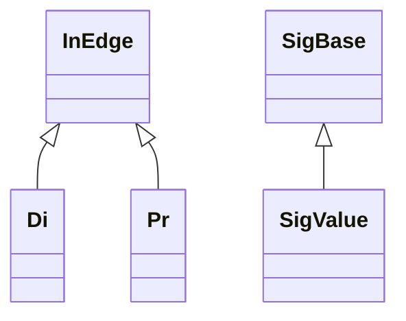

# `monocon_chuugoku.h` 主要クラス・構造体・メソッド一覧

## 対象

- 対象ファイル：`monocon_chuugoku.h`
- 主要クラス数：20
- 主要構造体・型補助テンプレート数：5
- 列挙型数：2
- `public`、`protected`、`private`の主要メソッドを掲載
- コンストラクタ、デストラクタ、演算子オーバーロード、削除されたコピー操作、静的内部関数を含む

## 一覧

| 分類 | 名前 | 主な用途 |
|---|---|---|
| 構造体 | `Dch` | 二値入力のデバウンス状態を保持 |
| 内部クラス | `PollLock` | アナログ系入力の公開値更新間隔を制限 |
| クラス | `InEdge` | 二値入力のエッジ検出基底クラス |
| 内部基底クラス | `SigBase` | 全`SigValue<T>`のイベントと自動管理リストを共通管理 |
| クラステンプレート | `SigValue<T>` | 任意の値型を安定化し、値の変更を検出 |
| 型エイリアス | `Sig` | `SigValue<int32_t>`の別名 |
| マクロ | `sig(value, ...)` | 式の型に対応する静的`SigValue<T>`を生成・更新 |
| クラス | `Di` | デジタル入力 |
| クラス | `Pr` | フォトリフレクタ入力 |
| クラス | `Sok` | 測距センサ |
| クラス | `Vr` | 可変抵抗 |
| クラス | `Js` | ジョイスティック |
| クラス | `Enc` | ロータリーエンコーダ |
| クラス | `Led` | RGB LED |
| クラス | `Disp` | 3桁7セグメント表示器 |
| クラス | `Dcm` | DCモータ |
| 列挙型 | `Dir` | ステッピングモータの回転方向 |
| クラス | `Spm` | ステッピングモータ |
| クラス | `Bz` | ブザーとメロディー |
| クラス | `Seq` | シーケンス制御 |
| クラス | `Iv` | 周期タイマー |
| クラス | `Ti` | 単発タイマー |
| クラス | `Sw` | ストップウォッチ |
| クラス | `Tog` | 汎用トグル |
| 型補助構造体 | `board_detail::RemoveReference<T>` | 参照修飾を除去 |
| 型補助構造体 | `board_detail::RemoveCv<T>` | `const`・`volatile`修飾を除去 |
| 型補助構造体 | `board_detail::SignalValueType<T>` | `sig()`が保持する値型を決定 |
| 構造体 | `board_detail::AdcSlot` | ADC登録スロット |
| 列挙型 | `Spm::Excitation` | ステッピングモータの励磁方式 |

---

## `Dch`

入力のデバウンス処理で使用する内部状態構造体です。メソッドはありません。

### メンバー

| 型 | 名前 | 内容 |
|---|---|---|
| `uint8_t` | `stable` | 現在の安定状態 |
| `uint8_t` | `candidate` | 安定候補の状態 |
| `uint32_t` | `stableSince` | 現在の安定状態になった時刻 |
| `uint32_t` | `candidateSince` | 候補状態が始まった時刻 |
| `bool` | `candidateActive` | 候補状態を確認中か |
| `bool` | `fired` | 長押しイベントを通知済みか |

---

## `PollLock`

アナログ系入力クラスの公開値を、指定間隔より頻繁に更新しないための内部クラスです。

`InEdge`のデバウンスとは目的が異なります。入力値が同じ状態を一定時間保つことを要求するのではなく、ADCの取得は継続したまま、利用者へ公開する値の更新周期を制限します。

### 公開メソッド

| シグネチャ | 内容 |
|---|---|
| `explicit PollLock(uint16_t lock = 10)` | 公開値の最小更新間隔をミリ秒で指定 |
| `bool due(uint32_t now)` | 初回、または前回許可時刻から`lock`以上経過したとき`true` |

---

## `InEdge`

`Di`と`Pr`が継承する、HIGH/LOWの二値入力専用エッジ検出基底クラスです。

任意の整数値や浮動小数点値の変化検出には`SigValue<T>`または`sig()`を使用します。

### 公開メソッド

| シグネチャ | 内容 |
|---|---|
| `explicit InEdge(uint16_t lock = 10)` | 状態変化を確定するまでのデバウンス時間をミリ秒で指定 |
| `bool ltoh()` | LOWからHIGHへの変化を1回取得 |
| `bool htol()` | HIGHからLOWへの変化を1回取得 |
| `bool level() const` | 現在の安定状態を取得 |
| `operator bool() const` | 現在の安定状態を`bool`として取得 |
| `bool held(uint16_t ms, bool lv, bool release = false)` | 指定状態の長押し、または解放時の長押しを判定 |
| `bool change()` | 方向を問わず状態変化を1回取得 |

### `protected`メソッド

| シグネチャ | 内容 |
|---|---|
| `void pollWith(uint8_t raw, uint32_t now)` | 生入力をデバウンスして安定状態とイベントへ反映 |
| `void serviceEdges(uint32_t epoch)` | 保持期限を過ぎたエッジイベントを破棄 |

---

## `SigBase`

すべての`SigValue<T>`が継承する内部基底クラスです。値そのものは保持せず、変更イベント、解放イベント、自動管理リストを共通管理します。

### 公開メソッド

| シグネチャ | 内容 |
|---|---|
| `SigBase(const SigBase&) = delete` | コピー構築を禁止 |
| `SigBase& operator=(const SigBase&) = delete` | コピー代入を禁止 |
| `static void serviceAll(uint32_t epoch)` | 全`SigValue<T>`の未取得イベントを保持期限後に破棄 |

### `protected`メソッド

| シグネチャ | 内容 |
|---|---|
| `SigBase()` | 自動管理リストへ登録 |
| `~SigBase()` | 自動管理リストから登録解除 |
| `void publishChange()` | 変更イベントを発行 |
| `void publishRelease()` | 変更前の値を離れたイベントを発行 |
| `bool takeChange(bool matches = true)` | 条件一致時に変更イベントを取得・消費 |
| `bool takeRelease(bool matches = true)` | 条件一致時に解放イベントを取得・消費 |
| `void clearEvents()` | 保留中のイベントを消去 |

### `private`メソッド

| シグネチャ | 内容 |
|---|---|
| `void attach()` | 自動管理リストへ登録 |
| `void detach()` | 自動管理リストから登録解除 |

---

## `SigValue<T>`・`Sig`・`sig()`

任意の数値・論理値を安定化し、値の変更をイベントとして取得するクラステンプレートです。

`Sig`は次の型エイリアスです。

```cpp
using Sig = SigValue<int32_t>;
```

式を直接監視する場合は、通常は`sig()`マクロを使用します。式の型から`SigValue<T>`が自動的に選ばれ、呼び出し位置ごとに静的オブジェクトが1個生成されます。

```cpp
auto& s = sig(n);

if (s.change() && s != -1) {
    // 値が変化し、変更後の確定値が-1ではない
}
```

`operator T()`により、`s.value()`を呼ばずに現在の確定値を比較・代入できます。

```cpp
int value = s;
if (s == 2) {}
if (s > 10) {}
```

### コンストラクタ

| シグネチャ | 内容 |
|---|---|
| `explicit SigValue(uint16_t lock = 10, T tolerance = T())` | 候補値の確定時間と同一値とみなす許容差を指定 |

`lock == 0`では候補値を直ちに確定します。アナログ値では完全一致が続かない場合があるため、必要に応じて`tolerance`を指定します。

```cpp
auto& a = sig(vr.raw(), 20, 3);     // 20ms、±3以内は同一値

auto& b = sig(sok.cm(), 50, 0.2f); // 50ms、±0.2cm以内は同一値
```

> 実装確認：`same()`内では`nearValue<T>(...)`ではなく`nearValue(...)`と呼び出してください。`<T>`を明示すると、`float`・`double`専用オーバーロードが選ばれず、浮動小数点の許容差判定が正しく機能しません。

### 公開メソッド

| シグネチャ | 内容 |
|---|---|
| `T set(T value)` | 新しい観測値を入力し、現在の確定値を返す |
| `T update(T value)` | `set()`と同じ |
| `T operator()(T value)` | `set()`と同じ |
| `void reset(T value = T())` | 指定値で初期化し、保留イベントを消去 |
| `bool initialized() const` | 最初の値が入力済みかを取得 |
| `T level() const` | 現在の確定値を取得 |
| `T previous() const` | 直前の確定値を取得 |
| `operator T() const` | 現在の確定値へ暗黙変換 |
| `bool change()` | 任意の値変更を1回取得 |
| `bool changed()` | `change()`と同じ |
| `bool change(T from, T to)` | `from`から`to`への変更だけを1回取得 |
| `bool from(T value)` | 指定値から離れた変更を1回取得 |
| `bool to(T value)` | 指定値になった変更を1回取得 |
| `bool up()` | 値が増加した変更を1回取得 |
| `bool down()` | 値が減少した変更を1回取得 |
| `bool ltoh()` | `0`から`0以外`への変更を1回取得 |
| `bool htol()` | `0以外`から`0`への変更を1回取得 |
| `bool held(uint16_t ms, T value, bool release = false)` | 指定値の継続、またはその値から離れた時点の継続時間を判定 |
| `uint32_t elapsed() const` | 現在の確定値になってからの経過時間を取得 |

変更イベントを取得するメソッドは、条件が一致して`true`を返した時点でイベントを消費します。一致しなかった判定では消費しません。

```cpp
if (s.change(1, 2)) {
    // 1 → 2
} else if (s.change(2, 3)) {
    // 2 → 3
} else if (s.change()) {
    // その他の変更
}
```

### `private`メソッド

| シグネチャ | 内容 |
|---|---|
| `static bool nearValue(...)` | 整数・`float`・`double`について許容差内かを判定 |
| `bool same(T a, T b) const` | 設定済み許容差を使って2値を比較 |
| `void initialize(T value, uint32_t now)` | 指定値を初期確定値として設定 |
| `void commit(T value, uint32_t now)` | 候補値を確定し、変更イベントを発行 |

---

## `Di : public InEdge`

デジタル入力をエッジ付きで読み取るクラスです。`InEdge`の公開メソッドも使用できます。

### 公開メソッド

| シグネチャ | 内容 |
|---|---|
| `explicit Di(uint8_t pin, uint16_t lock = 10)` | 入力ピンとデバウンス時間を指定して生成 |
| `~Di()` | 自動管理リストから登録解除 |
| `Di(const Di&) = delete` | コピー構築を禁止 |
| `Di& operator=(const Di&) = delete` | コピー代入を禁止 |
| `static void serviceAll(uint32_t now)` | 全`Di`の物理入力を読み取る |
| `static void serviceEvents(uint32_t epoch)` | 全`Di`のイベント保持期限を処理 |

### `private`メソッド

| シグネチャ | 内容 |
|---|---|
| `bool valid() const` | ピンと管理リストへの登録が有効かを内部確認 |

---

## `Pr : public InEdge`

ADC値をしきい値で二値化するフォトリフレクタ入力クラスです。`InEdge`の公開メソッドも使用できます。

### 公開メソッド

| シグネチャ | 内容 |
|---|---|
| `explicit Pr(uint8_t pin, int threshold = 950, uint16_t lock = 10)` | ADCピン、しきい値、デバウンス時間を指定して生成 |
| `~Pr()` | 管理リストとADCから登録解除 |
| `Pr(const Pr&) = delete` | コピー構築を禁止 |
| `Pr& operator=(const Pr&) = delete` | コピー代入を禁止 |
| `int raw() const` | 最新のADC生値を安全に取得 |
| `static void serviceAll(uint32_t now)` | 全`Pr`をしきい値判定してエッジ処理 |
| `static void serviceEvents(uint32_t epoch)` | 全`Pr`のイベント保持期限を処理 |

### `private`メソッド

| シグネチャ | 内容 |
|---|---|
| `bool ready() const` | ADCの初回変換が完了したかを内部確認 |
| `bool valid() const` | ADCと管理リストへの登録が有効かを内部確認 |

---

## `Sok`

5サンプルの中央値から距離を求める測距センサクラスです。ADCサンプリングは継続し、中央値と距離の公開値はコンストラクタで指定した`lock`間隔ごとに更新します。

### 公開メソッド

| シグネチャ | 内容 |
|---|---|
| `explicit Sok(uint8_t pin, uint16_t lock = 10)` | ADCピンと公開値の最小更新間隔を指定して生成 |
| `~Sok()` | 管理リストとADCから登録解除 |
| `Sok(const Sok&) = delete` | コピー構築を禁止 |
| `Sok& operator=(const Sok&) = delete` | コピー代入を禁止 |
| `int raw() const` | 最後に確定した中央値ADC値を取得 |
| `int mm() const` | 最後に確定した距離をミリメートルで取得 |
| `float cm() const` | 最後に確定した距離をセンチメートルで取得 |
| `static void serviceAll(uint32_t now)` | 全`Sok`のサンプリングと、lockに従う距離更新を実行 |

### `private`メソッド

| シグネチャ | 内容 |
|---|---|
| `bool ready() const` | 5サンプルの初回処理が完了したかを内部確認 |
| `bool valid() const` | ADCと管理リストへの登録が有効かを内部確認 |
| `void serviceOne(uint32_t now)` | 1サンプルを追加し、更新時刻なら中央値と距離を確定 |

---

## `Vr`

可変抵抗のADC値を指定範囲へ変換するクラスです。ADC変換は非同期で継続し、利用者へ公開する値を`lock`間隔ごとに更新します。

### 公開メソッド

| シグネチャ | 内容 |
|---|---|
| `explicit Vr(uint8_t pin, int minValue = 0, int maxValue = 512, uint16_t lock = 10)` | ADCピン、入力範囲、公開値の最小更新間隔を指定して生成 |
| `~Vr()` | 管理リストとADCから登録解除 |
| `Vr(const Vr&) = delete` | コピー構築を禁止 |
| `Vr& operator=(const Vr&) = delete` | コピー代入を禁止 |
| `int raw() const` | 最後に確定したADC値を取得 |
| `int to(int lo, int hi) const` | 確定ADC値を`lo`から`hi`の範囲へ線形変換 |
| `static void serviceAll(uint32_t now)` | 全`Vr`の公開値をlockに従って更新 |

### `private`メソッド

| シグネチャ | 内容 |
|---|---|
| `bool ready() const` | 公開値の初回更新が完了したかを内部確認 |
| `bool valid() const` | ADCと管理リストへの登録が有効かを内部確認 |
| `void serviceOne(uint32_t now)` | 更新時刻ならADC値を公開値へ反映 |

---

## `Js`

ジョイスティックの座標と方向を取得するクラスです。X軸とY軸は一組として、`lock`間隔ごとに同時更新されます。

### 公開メソッド

| シグネチャ | 内容 |
|---|---|
| `Js(uint8_t px, uint8_t py, uint16_t lock = 10)` | X・Y軸のADCピンと公開値の最小更新間隔を指定して生成 |
| `~Js()` | 管理リストと2軸のADC登録を解除 |
| `Js(const Js&) = delete` | コピー構築を禁止 |
| `Js& operator=(const Js&) = delete` | コピー代入を禁止 |
| `int x() const` | 最後に確定したX軸値を取得 |
| `int y() const` | 最後に確定したY軸値を取得 |
| `void read(int& vx, int& vy) const` | 同じ更新時点のX軸・Y軸を取得 |
| `int dir(int div, uint8_t rot = 0, bool mirror = false) const` | 方向を`div`分割した番号で取得。中心では`-1` |
| `static void serviceAll(uint32_t now)` | 全`Js`の2軸公開値をlockに従って同時更新 |

### `private`メソッド

| シグネチャ | 内容 |
|---|---|
| `bool ready() const` | 両軸の公開値が初回更新済みかを内部確認 |
| `bool valid() const` | ADCと管理リストへの登録が有効かを内部確認 |
| `void serviceOne(uint32_t now)` | 更新時刻ならX・YのADC値を同時に公開値へ反映 |

---

## `Enc`

ロータリーエンコーダの回転差分を割り込みで取得するクラスです。

A相・B相の状態遷移は従来どおりPCINTまたはTimer1で高速に読み取ります。コンストラクタの`lock`は生ポーリングを停止するものではなく、完全な回転イベントを受け付ける最小間隔です。相変化そのものを間引かないため、方向判定に必要な中間状態を保持できます。

### 公開メソッド

| シグネチャ | 内容 |
|---|---|
| `Enc(uint8_t pa, uint8_t pb, bool d = true, uint16_t lock = 10)` | A相、B相、方向設定、回転イベントの最小受付間隔を指定して生成 |
| `~Enc()` | 管理リストから登録解除し、割り込み設定を再構築 |
| `Enc(const Enc&) = delete` | コピー構築を禁止 |
| `Enc& operator=(const Enc&) = delete` | コピー代入を禁止 |
| `int32_t delta()` | 未取得の回転差分を取得して0へ戻す |
| `int32_t clampTo(int32_t value, int32_t lo, int32_t hi)` | 回転差分を加算し、指定範囲で制限 |
| `int32_t loopTo(int32_t value, int32_t lo, int32_t hi)` | 回転差分を加算し、指定範囲で循環 |

### `private`メソッド

| シグネチャ | 内容 |
|---|---|
| `inline bool acceptEvent()` | 前回受理した回転イベントからlock以上経過しているかを判定 |
| `inline void poll()` | A相・B相の状態遷移を読み、受理可能な回転イベントを加算 |
| `int32_t take()` | 累積差分をアトミックに取得して0へ戻す |
| `bool valid() const` | ピンと管理リストへの登録が有効かを内部確認 |
| `static void beginPolling(bool forceTimer = false)` | PCINTとTimer1のポーリング構成を設定 |
| `static inline void isrPollFallback()` | PCINTを使えないエンコーダをTimer1 ISRから読む |
| `static inline void isrPcint(uint8_t group)` | 指定PCINTグループの変化を処理 |

### `friend`関数

| シグネチャ | 内容 |
|---|---|
| `friend void begin()` | 初期化時に`beginPolling()`を呼び出す |
| `friend void ::PCINT0_vect(void)` | PCINT0割り込みから内部処理を呼び出す |
| `friend void ::PCINT1_vect(void)` | PCINT1割り込みから内部処理を呼び出す |
| `friend void ::PCINT2_vect(void)` | PCINT2割り込みから内部処理を呼び出す |
| `friend void ::TIMER1_COMPA_vect(void)` | Timer1割り込みから内部処理を呼び出す |

---

## `Led`

RGB LEDの色と明るさを制御するクラスです。

### 公開メソッド

| シグネチャ | 内容 |
|---|---|
| `Led()` | 消灯状態、明るさ100%で初期化 |
| `void operator()(uint8_t newColor = 0, int opacityPercent = 100)` | 色と0～100%の明るさを設定。色を省略すると消灯 |
| `void serviceTick()` | ΣΔ方式の明るさ制御を1周期処理 |

### `private`メソッド

| シグネチャ | 内容 |
|---|---|
| `void writeState(uint8_t state)` | RGB各出力をポートへ反映 |

---

## `Disp`

3桁7セグメント表示器を制御するクラスです。

### 公開メソッド

| シグネチャ | 内容 |
|---|---|
| `Disp()` | 全桁消灯、明るさ100%で初期化 |
| `Disp& operator()(uint8_t a, uint8_t b, uint8_t c)` | 3桁の生セグメントパターンを設定 |
| `template <size_t NA, size_t NB, size_t NC> Disp& art(const char (&a)[NA], const char (&b)[NB], const char (&c)[NC])` | 3桁それぞれの1～8番セグメントを、文字列中の`.`で指定 |
| `Disp& off()` | 全桁を消灯 |
| `Disp& s(const char* text)` | 文字列の先頭3文字を表示 |
| `Disp& n(int x, bool zero = false, bool left = false)` | 符号付き整数を表示 |
| `Disp& f(double f, bool zero = false, bool left = false)` | 表示可能な桁数へ自動調整して小数を表示 |
| `Disp& o(int oa, int ob, int oc)` | 3桁それぞれの明るさを設定 |
| `Disp& o(int oa, int ob)` | 1桁目と、共通明るさの2・3桁目を設定 |
| `Disp& o(int oa)` | 全桁を同じ明るさに設定 |
| `Disp& base(int32_t x, uint8_t radix, bool zero = false)` | 2～36進数の下位3桁を表示 |
| `void serviceTick()` | 3桁のΣΔ方式明るさ制御を1周期処理 |

### `private`メソッド

| シグネチャ | 内容 |
|---|---|
| `static uint8_t toPattern(char c)` | 文字をセグメントパターンへ変換 |
| `static uint8_t digitPattern(uint8_t value)` | 0～35を数字・英字パターンへ変換 |
| `static uint8_t artPattern(const char* s)` | `art()`用文字列の1～8文字目をセグメントパターンへ変換 |

### `art()`によるセグメント直接指定

数字や英字として用意されていない表示を、16進数へ変換せずに指定するためのメソッドです。

7セグメントの番号は次の順番です。

```text
 1
6 2
 7
5 3
 4  8
```

文字列の左から1～8文字目が、それぞれ1～8番のセグメントに対応します。

- `.`：対応するセグメントを点灯
- 空白：対応するセグメントを消灯
- 文字列が途中で終わった場合：残りのセグメントをすべて消灯
- `""`：その桁をすべて消灯
- 第2・第3引数も必須。消灯する桁には`""`を指定

#### 基本例

```cpp
dp.art(".  ...", ".  .", "....");
```

各引数が左・中央・右の桁に対応します。

```cpp
dp.art("左桁", "中央桁", "右桁");
```

末尾の空白は省略できます。次の2つは同じ表示です。

```cpp
dp.art("   .    ", "", "");
dp.art("   .", "", "");
```

何も表示しない桁は空文字列で指定できます。

```cpp
dp.art(".", "", ".");
```

3引数はすべて必要です。右側の桁を消灯する場合も空文字列を明示します。

```cpp
dp.art(".", "", "");
```

#### 1桁分の指定例

| 指定 | 表示内容 |
|---|---|
| `""` | 全セグメント消灯 |
| `"."` | 1番だけ点灯 |
| `"   ."` | 4番だけ点灯 |
| `"       ."` | 8番の小数点だけ点灯 |
| `"......"` | 1～6番を点灯して`0`を表示 |
| `"......."` | 1～7番を点灯して`8`を表示 |
| `".  .  ."` | 1・4・7番の横線を点灯 |

#### `A.1E`の表示例

```cpp
dp.art("... ....", " ..", ".  ....");
```

1桁目は`A`と小数点、2桁目は`1`、3桁目は`E`を表示します。

### 外周を100msごとに1セグメントずつ点灯する例

3桁の外周を、左上から時計回りに1セグメントずつ移動させます。

```cpp
#include "monocon_chuugoku.h"

void loop() {
	static constexpr char data[][3][9] = {
		{ ".",     "",      "" },
		{ "",      ".",     "" },
		{ "",      "",      "." },
		{ "",      "",      " ." },
		{ "",      "",      "  ." },
		{ "",      "",      "   ." },
		{ "",      "   .",  "" },
		{ "   .",  "",      "" },
		{ "    .", "",      "" },
		{ "     .", "",     "" }
	};

	static Iv iv;
	static uint8_t i = 0;

	dp.art(data[i][0], data[i][1], data[i][2]);

	if (iv(100)) {
		i = (i + 1) % (sizeof(data) / sizeof(data[0]));
	}
}
```

配列の各要素は、次の順序で1セグメントだけを点灯します。

```text
左桁1番 → 中央桁1番 → 右桁1番
→ 右桁2番 → 右桁3番 → 右桁4番
→ 中央桁4番 → 左桁4番 → 左桁5番 → 左桁6番
```

`char data[][3][9]`の各次元は次の意味です。

```text
data[アニメーションのコマ数][3桁][最大8文字＋終端文字]
```

文字列が8文字未満でも、残りは消灯として扱われます。


---

## `Dcm`

DCモータの回転、停止、時間指定運転を制御するクラスです。

### 公開メソッド

| シグネチャ | 内容 |
|---|---|
| `Dcm()` | 停止状態で初期化 |
| `void cw(int spd)` | 指定PWM値でCW連続回転 |
| `void cw(int spd, uint32_t durationMs)` | 指定PWM値と時間でCW回転 |
| `void ccw(int spd)` | 指定PWM値でCCW連続回転 |
| `void ccw(int spd, uint32_t durationMs)` | 指定PWM値と時間でCCW回転 |
| `void br()` | ブレーキ停止 |
| `void fr()` | フリー停止 |
| `bool busy() const` | 時間指定運転中かを取得 |
| `int8_t dir() const` | 現在の回転方向を取得。CWは`1`、CCWは`-1`、停止は`0` |
| `bool done()` | 時間指定運転の完了イベントを1回取得 |
| `inline void isrTick()` | 1msごとに残り時間を更新 |

### 公開メンバー

| 型 | 名前 | 内容 |
|---|---|---|
| `volatile int8_t` | `now` | 内部の回転方向状態。通常は`dir()`で取得 |

### `private`メソッド

| シグネチャ | 内容 |
|---|---|
| `inline void stopFromIsr()` | ISRから安全にフリー停止 |

---

## `Dir`

ステッピングモータの方向指定に使用する公開列挙型です。

| 値 | 内容 |
|---|---|
| `CW` | 時計回りを指定 |
| `CCW` | 反時計回りを指定 |
| `SHORT` | 最短経路を指定 |

---

## `Spm`

ステッピングモータの単発ステップ、相対角度、絶対角度移動を制御するクラスです。

### 公開メソッド

| シグネチャ | 内容 |
|---|---|
| `explicit Spm(Excitation mode = TWO_PHASE)` | 励磁方式を指定して初期化 |
| `void cw()` | CWへ1ステップ動かす |
| `void ccw()` | CCWへ1ステップ動かす |
| `void fr()` | 目標位置で停止し、励磁を解除 |
| `void br()` | 目標位置で停止し、現在相を励磁 |
| `void _one()` | 一相励磁へ変更 |
| `void _two()` | 二相励磁へ変更 |
| `void rela(float degree)` | 現在の目標位置へ相対角度を加算 |
| `void abso(float degree, Dir dir = SHORT, Dir halfDir = CCW)` | 絶対角度と経路方向を指定 |
| `void update(uint32_t intervalMs)` | 指定ミリ秒間隔で目標へ1ステップ進める |
| `bool busy() const` | 目標位置への移動中かを取得 |
| `int8_t dir() const` | 現在の目標方向を取得。CWは`1`、CCWは`-1`、停止は`0` |
| `void stop()` | 現在位置を目標位置にして移動を停止 |
| `void zero()` | 現在位置と目標位置を0°に設定 |
| `float pos() const` | 累積位置を度数で取得 |
| `int32_t stepPos() const` | 累積位置をステップ数で取得 |

### `private`メソッド

| シグネチャ | 内容 |
|---|---|
| `void phase(uint8_t s)` | 指定相の出力パターンを反映 |
| `void mode(Excitation newMode)` | 励磁方式を変更して現在相を再出力 |
| `int32_t degreeToStep(float degree) const` | 角度を2048ステップ/回転のステップ数へ変換 |
| `void stepCw()` | 内部基準のCWへ1ステップ進める |
| `void stepCcw()` | 内部基準のCCWへ1ステップ進める |

### `private`列挙型 `Excitation`

| 値 | 内容 |
|---|---|
| `ONE_PHASE` | 一相励磁 |
| `TWO_PHASE` | 二相励磁 |

---

## `Bz`

単音、時間指定音、メロディーを制御するクラスです。

### 公開メソッド

| シグネチャ | 内容 |
|---|---|
| `Bz()` | 停止状態で初期化 |
| `void operator()(int frequency)` | 指定周波数の連続音を鳴らす |
| `void operator()(int f, uint32_t durationMs)` | 指定周波数を指定時間だけ鳴らす |
| `void play(const int* notes, const int* durations, int length, bool repeat = false)` | 音階・長さ配列をメロディーとして再生 |
| `void stop()` | 単音とメロディーを停止 |
| `void off()` | `stop()`と同じ |
| `bool playing() const` | メロディー再生中かを取得 |
| `void update()` | メロディーを次の音へ進める |
| `inline void isrTick()` | 時間指定音の残り時間を1ms進める |

### `private`メソッド

| シグネチャ | 内容 |
|---|---|
| `static uint16_t topForFrequency(int f)` | 周波数からTimer3のTOP値を計算 |
| `void start(int f, uint32_t durationMs, bool timed)` | Timer3で発音を開始 |
| `inline void stopFromIsr()` | ISRから安全に発音を停止 |

---

## `Seq`

`if (q)`の呼び出し位置を0始まりの段番号として扱うシーケンス制御クラスです。

遷移は予約ではなく、`next()`、`prev()`、`to()`を呼んだ時点で`current_`へ即時反映されます。これにより、遷移元の状態ブロックが次の`loop()`でもう一度実行される問題を防ぎます。

- 遷移先の`if (q)`が現在の`loop()`でまだ評価されていない場合：同じ`loop()`内で遷移先を実行
- 遷移先の`if (q)`がすでに評価済みの場合：次の`loop()`で遷移先を実行
- 遷移元の状態全体を、終了処理のために再実行することはない

### 公開メソッド

| シグネチャ | 内容 |
|---|---|
| `Seq() = default` | 0段目から開始 |
| `Seq(const Seq&) = delete` | コピー構築を禁止 |
| `Seq& operator=(const Seq&) = delete` | コピー代入を禁止 |
| `bool on()` | 現在の呼び出し位置が実行対象の段かを判定 |
| `bool operator()()` | `on()`と同じ |
| `explicit operator bool()` | `on()`と同じ |
| `void next()` | 次の段へ即時遷移。最終段の次は0段目 |
| `void prev()` | 前の段へ即時遷移。0段目の前は最終段 |
| `void to(int state)` | 指定段へ即時遷移 |
| `void restart()` | 現在段の経過時間と`in()`イベントを再初期化 |
| `bool is(int state)` | 現在段が指定段かを判定 |
| `int now()` | 現在の段番号を取得 |
| `int steps()` | 検出済みの総段数を取得 |
| `bool in()` | 現在段へ入ったイベントを1回取得 |
| `bool out()` | 同じ状態ブロック内で遷移した直後に、退出イベントを1回取得 |
| `uint32_t elapsed()` | 現在段へ入ってからの経過時間を取得 |
| `bool after(uint32_t ms)` | 現在段で指定時間以上経過したかを判定 |

### 状態番号

最初の`if (q)`は状態0です。

```cpp
if (q) { // 状態0
}
if (q) { // 状態1
}
if (q) { // 状態2
}
```

したがって、`q.to(2)`は3個目の`if (q)`へ移動します。

### 一度だけ実行する処理

タイマー開始、配列への保存、カウンタ増加など、状態へ入ったとき一度だけ行う副作用は`q.in()`内に書きます。

```cpp
if (q) {
    if (q.in()) {
        score[phase] = stopwatch.ms();
        phase++;
    }
}
```

即時遷移により旧状態が次の`loop()`で再実行されることはありませんが、`q.in()`を使うと処理の意図が明確になります。

### `out()`の成立条件

`out()`は、遷移命令より後の同じ状態ブロック内で呼んだ場合だけ成立します。

```cpp
if (q) {
    if (sw1.htol()) {
        q.next();
    }

    if (q.out()) {
        led();
        dp.off();
    }
}
```

次の順序では、`out()`を評価した時点で遷移が発生していないため成立しません。

```cpp
if (q) {
    if (q.out()) { // 常に遷移前
    }

    if (sw1.htol()) {
        q.next();
    }
}
```

また、すべての状態ブロックの後など、状態ブロック外で`q.to()`を呼んだ場合、その状態ブロック内の`out()`では取得できません。

```cpp
if (q) {
    // 状態処理
}

if (sw2.htol()) {
    q.to(0); // この遷移を、上のブロック内のout()では取得できない
}
```

確実な終了処理が必要な場合は、遷移直前に直接記述する方法が最も明確です。

```cpp
if (q) {
    if (sw1.htol()) {
        stopwatch.stop();
        led();
        q.next();
    }
}
```

### `private`メソッド

| シグネチャ | 内容 |
|---|---|
| `int clampState(int state) const` | 段番号を有効範囲へ制限 |
| `void syncLoop()` | `loopEpoch`の変更を検出し、呼び出し位置を0へ戻す |
| `void moveTo(int state)` | 退出元を記録し、指定段を即座に現在段へ設定 |

---

## `Iv`

一定時間ごとに1回だけ成立する周期タイマークラスです。

明示的なコンストラクタはなく、暗黙のデフォルトコンストラクタが使用されます。

### 公開メソッド

| シグネチャ | 内容 |
|---|---|
| `bool operator()(uint32_t ms)` | 初回または即時リセット後は直ちに`true`。以後は指定周期ごとに1回だけ`true` |
| `void reset(bool immediate = true)` | 周期の基準時刻を現在へ戻す。`true`なら次回呼び出しを直ちに成立させる |
| `void wait()` | 周期タイマーを一時停止 |
| `void go()` | 一時停止時間を除外して再開 |
| `bool isWait() const` | 一時停止中かを取得 |

---

## `Ti`

開始後、指定時間が経過したとき1回だけ完了する単発タイマークラスです。

明示的なコンストラクタはなく、暗黙のデフォルトコンストラクタが使用されます。

### 公開メソッド

| シグネチャ | 内容 |
|---|---|
| `void start(uint32_t ms)` | 指定時間で開始または再開始 |
| `void stop()` | 完了イベントを発生させず停止 |
| `bool active() const` | 動作中かを取得 |
| `bool done()` | 期限到達時に1回だけ`true`を返して停止 |
| `uint32_t remain() const` | 残り時間をミリ秒で取得 |

---

## `Sw`

経過時間を測るストップウォッチクラスです。

明示的なコンストラクタはなく、暗黙のデフォルトコンストラクタが使用されます。

### 公開メソッド

| シグネチャ | 内容 |
|---|---|
| `void start()` | 0から計測を開始または再開始 |
| `void stop()` | 現在の経過時間を固定して停止 |
| `void reset()` | 停止して経過時間を0へ戻す |
| `bool running() const` | 計測中かを取得 |
| `uint32_t ms() const` | 経過時間をミリ秒で取得 |
| `uint32_t operator()() const` | `ms()`と同じ |
| `operator uint32_t() const` | 経過時間へ暗黙変換 |

---

## `Tog`

呼び出すたびに状態を反転する汎用トグルクラスです。

### 公開メソッド

| シグネチャ | 内容 |
|---|---|
| `explicit Tog(bool initial = true)` | 初期状態を指定して生成 |
| `bool operator()()` | 反転前の値を返してから状態を反転 |
| `template<class T> T operator()(T first, T second)` | 反転前の状態に応じて2値を交互に返す |
| `operator bool() const` | 現在の状態を`bool`として取得 |
| `bool get() const` | 現在の状態を取得 |
| `void flip()` | 戻り値なしで状態を反転 |
| `void reset(bool initial = true)` | 指定した初期状態へ戻す |

---

## `board_detail`の型補助構造体

`<type_traits>`へ依存せず、`sig()`へ渡された式から保持値型を決定するための内部テンプレートです。

| 名前 | 内容 |
|---|---|
| `RemoveReference<T>` | `T&`、`T&&`から参照修飾を除去 |
| `RemoveCv<T>` | `const`、`volatile`、`const volatile`を除去 |
| `SignalValueType<T>` | 参照修飾とCV修飾を除去した、`SigValue`の保持型を定義 |

通常の利用コードから直接使用する必要はありません。

---

## `board_detail::AdcSlot`

非同期ADCの1登録分を保持する内部構造体です。メソッドはありません。

### メンバー

| 型 | 名前 | 内容 |
|---|---|---|
| `uint8_t` | `admux` | `ADMUX`へ設定する値 |
| `uint8_t` | `mux5` | `ADCSRB`の`MUX5`設定値 |
| `uint8_t` | `channel` | ADCチャンネル番号 |
| `volatile int*` | `dst` | 変換結果の書き込み先 |
| `volatile bool` | `ready` | 初回変換が完了したか |

---

## 継承関係


```mermaid
classDiagram
    InEdge <|-- Di
    InEdge <|-- Pr
    SigBase <|-- SigValue
```

`Di`と`Pr`では、それぞれの表に加えて次の`InEdge`公開メソッドを使用できます。

- `ltoh()`
- `htol()`
- `level()`
- `operator bool()`
- `held()`
- `change()`

`Sig`はクラスではなく、次の型エイリアスです。

```cpp
using Sig = SigValue<int32_t>;
```

`SigValue<T>`は`InEdge`を継承しません。二値入力用の`InEdge`と、任意値用の`SigValue<T>`は別系統です。

---

## 自動生成されるグローバルオブジェクト

| 型 | オブジェクト名 | 用途 |
|---|---|---|
| `Led` | `led` | RGB LED |
| `Disp` | `dp` | 3桁7セグメント表示器 |
| `Dcm` | `dm` | DCモータ |
| `Spm` | `sm` | ステッピングモータ |
| `Bz` | `bz` | ブザー |
